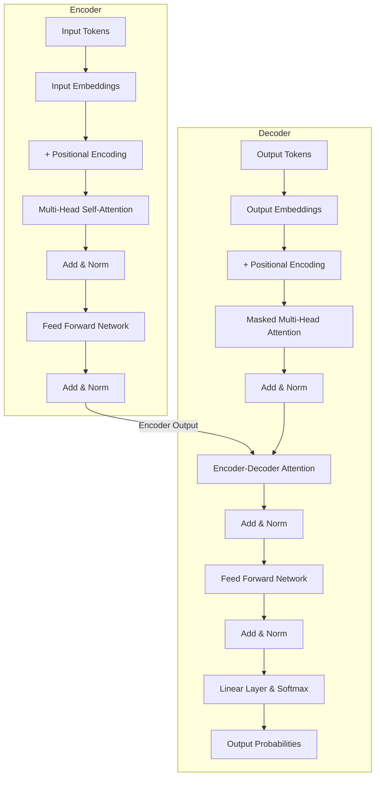

# Stanford CME295: Transformers & LLMs - Lecture 1

This repository contains my learnings, notes, and code implementations from **Lecture 1** of the Stanford CME295 course on Transformers and Large Language Models.

## Concepts Covered
The video covers the foundational elements of modern Natural Language Processing (NLP), building up to the Transformer architecture:

1. **NLP Overview & Tasks**: Understanding what NLP is and common tasks like translation, sentiment analysis, and text generation.
2. **Tokenization**: The process of breaking down text into smaller pieces (tokens) like words or subwords so that a computer can process them.
3. **Embeddings**: Converting tokens into dense vectors of real numbers. This allows the model to capture semantic meanings (e.g., words with similar meanings are closer in vector space).
4. **Architectures**:
   - **Word2vec**: An early method for creating word embeddings.
   - **RNNs (Recurrent Neural Networks)**: Neural networks designed for sequential data, processing tokens one by one.
   - **LSTMs (Long Short-Term Memory)**: An improvement over RNNs that better handles long-term dependencies in text.
5. **Transformers & Self-Attention**: The core mechanism that revolutionized NLP. Instead of processing tokens sequentially, self-attention allows the model to look at all tokens in a sentence simultaneously and determine which words are most relevant to each other.

## Transformer Architecture
The Transformer model, introduced in the paper *"Attention Is All You Need"* (2017), drops recurrent layers entirely in favor of an architecture built primarily on attention mechanisms. The core components include:

- **Encoder**: Processes the input text. It consists of a stack of identical layers, each with two main sub-layers:
  - *Multi-Head Self-Attention*: Allows the model to relate different words of the input sentence to each other.
  - *Position-wise Feed-Forward Network*: Applies a fully connected neural network to each position independently.
- **Decoder**: Generates the output text (used in sequence-to-sequence models like translation). It is similar to the Encoder but has an extra sub-layer:
  - *Masked Multi-Head Attention*: Prevents the decoder from looking ahead at future tokens it is trying to predict.
  - *Encoder-Decoder Attention*: Allows the decoder to focus on relevant parts of the input sequence processed by the encoder.
- **Positional Encoding**: Since Transformers process all tokens simultaneously (without a built-in sequential order like RNNs), positional encodings are injected into the input embeddings to provide the model with information about the relative or absolute position of the tokens in the sequence.

### Architecture Flowchart



## Repository Structure
- `tokenization_example.py`: A simple script demonstrating how tokenization works.
- `self_attention.py`: A basic PyTorch implementation of the Self-Attention mechanism.
- `notes/`: (To be added) Detailed markdown notes for the lecture.

## Getting Started
To run the examples in this repository, you'll need Python installed. For the self-attention script, you will need `torch`:

```bash
pip install torch
```
